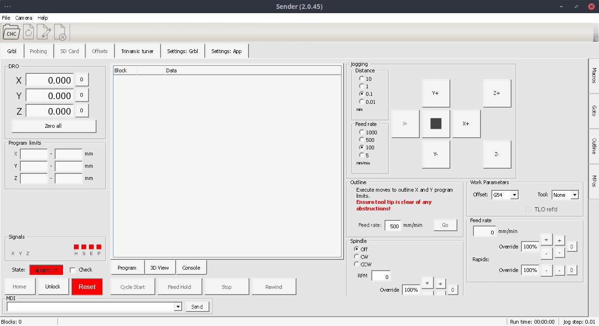

# grblHAL ioSender on Linux

This page is dedicated to tips and tricks for running the native windows grblHAL ioSender ([github](https://github.com/terjeio/ioSender)) application under Wine in Linux. The real solution, a project capable of building the ioSender application for Linux does not seem to be in the pipeline anywhere. So this page is only relevant while we wait for someone to give a native ioSender for Linux a go :-)

For configuration tasks on grblhal based controllers the accompanion application ioSender, written by the grblhal author, is undisputedly the go-to tool when bringing up a new grblhal driven CNC. Unfortunately the ioSender project is very much a windows application which is a petty for those running their CNC stuff under Linux. It is however possible to run (*) parts of ioSender under Wine given enough dedication.

(*) it runs until it doesn't want to run anymore which might happen rather frequently and parts of the graphical interface is off-limits since it uses libraries that doesn't seem to exist outside microsoft. So it is up to you to decide if this page is an unambitious train wreck or if it contains the hope of a much-better-than-nothing solution when bringing up grblHAL controllers while running under Linux.


*Parts that works (*\*)

* The default GUI (except the 3D view tab), including job and spindle control and the essential grblhal configuration menu. Including the full setup save, nice for backups and settings pages for tinkering with stepper controllers etc. 

* GCode file loading. Nice for a native grblhal gcode syntax check if needed.

*Parts that works where the crashing part gets prohibitive. YMMV.*

* GCode processing e.g. running a job


So in short then the recommendation is to use ioSender for configurations and for actual work use some of the other nice gcode senders running natively on Linux.


## Running ioSender.exe on a recent Ubuntu under Wine


### 1 Get user permission on the serial USB communication

```
#adduser $USER dialout
```

Logout/login for the change to take effect.

### 2 Install wine

```
#apt install wine
```

Test that it works

```
wine notepad
```

An Arch linux barfed about a missing display for all wine gui applications. Installing lib32-libglvnd and a reboot was probably the fix that made it work. On Arch also install [wine-mono](https://dl.winehq.org/wine/wine-mono/) manually, see further below.

### 3 Attach the controller

Run dmesg and figure out where the controller USB serial turns up. Probably /dev/ttyACM0 or the like. Alternatively just figure out which /dev/ttyACM devices exists.


### 4 Map windows com ports to Wine serial ports

Run 'wine regedit' and in HKEY_LOCAL_MACHINE/Software/Wine/Ports make some serial port string mappings. ioSender seems to default to COM10 when starting so that would be the first one. Depending on how many crashes is expected (which might grab a new serial device if the controller is re-attached) then make some additional ones while you are at it:

```
COM10	/dev/ttyACM0
COM11	/dev/ttyACM1
```


### 5 Start ioSender.exe

For a start then run ioSender.exe from a terminal to get a convinient way to kill it with ctrl-c while getting it to work. Make a nice desktop shortcut later...

```
$wine ioSender.exe
```

On Ubuntu wine should now ask if it should download wine mono, say OK to that.

ioSender seems to crash often on the first start, might have something to do with the serial connection ? Anyway just start it again and hopefully you now have a somewhat functional ioSender running which managed to automatically connect to the controller at COM10.

If you are now greeted with a dialogue to create a config file after which ioSender shows up in all its glory then congratulations, you are now running ioSender on Linux :-)





#### **Optional manual installation of wine mono**

Only if it didn't happen automatically above. Go to [wine-mono/]( https://dl.winehq.org/wine/wine-mono/) and download the latest msi installer.

Then install it

```
$wine msiexec /i wine-mono-XXX-x86.msi
```


#### Versions used

* ioSender XL 2.0.45

* wine-mono-9.4.0-x86.msi


## It doesn't work

### EV_RXFLAG

Crash seen on Arch Linux: somewhere in the stacktrace 

```
0140:fixme:comm:wait_on EV_RXFLAG not handled

=================================================================
        Native Crash Reporting
=================================================================
Got a UNKNOWN while executing native code. This usually indicates
a fatal error in the mono runtime or one of the native libraries
used by your application.
=================================================================
wine: Unhandled page fault on read access to FFFFFFFF at address F7E85795 (thread 0148), starting debugger...
```

No fix for this one has been found. The "EV_RXFLAG" appear to be related to serial comms. Try again.


### Dialog "No response received from the controller, exiting"

Check the com port setting in App.config vs the actual /dev/ttyACM device used.

```
<PortParams>COM10:115200,N,8,1</PortParams>
```


### E-stop still active, exit ?

Assuming that this is a freshly baked controller with a blank eeprom settings storage. Anyway this is a normal response from grblHAL so the upside is that there is in fact a connection to the controller. This error will be a confusing showstopper if connecting with other grblHAL gcode senders since it looks as the controller might be there but other gsenders just refuses to work for no apparent reason. And they fail to convey that there is an active E-stop that prohibits them in connecting properly.

See https://github.com/grblHAL/core/wiki/First-Run-Grbl-Settings

This error was seen on a BTT SKR3 controller laying otherwise unconnected on the desk.

Start e.g. screen terminal

```
screen /dev/ttyACM0 115200
?
<Alarm|MPos:0.000,0.000,0.000|Bf:100,1024|FS:0,0|Pn:XYZHSEP>
```

Here is a full plate of alarms in the Pn: value. Here we Ignore the real task of getting them to make sense regarding to the real world sensor inputs and are just focusing on getting grblHAL happy:

```
$$=14
$14: Invert control pins as bitfield:
    1 - Feed hold (2)
    2 - Cycle start (4)
    6 - EStop (64)
$14=70
```


### Unhandled exeption, .. is not a supported culture

Clicking in the ui gives you an indismissable exception dialog. You need to kill the process manually.

See this [thread](https://askubuntu.com/questions/286139/how-to-change-locale-for-wine-only). So try running ioSender.exe with

```
LC_ALL=en_US.utf8 wine ioSender.exe 
```

